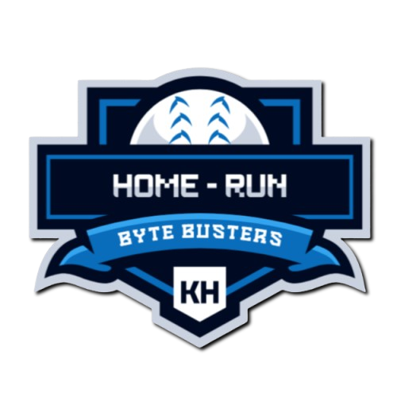
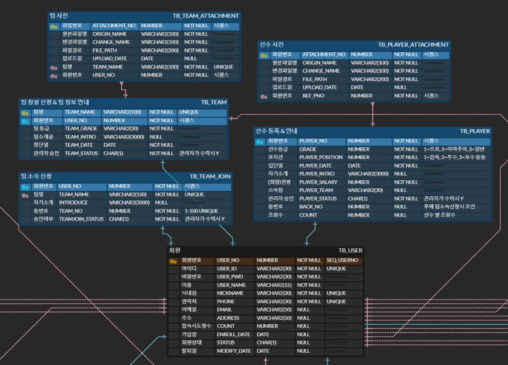

# ⚾ Home-Run

    

 

## ✅ 주제

야구 입문자부터 오랜 팬까지를 타겟팅한 야구에 관한 정보 공유 및 유사 야구선수 체험이 가능한 야구 종합 사이트

 

## 📅 인원 및 기간

- 5명
- 2024.12.24 - 25.01.09.

 

## 📜 프로젝트 컨셉 및 주요 기능

### 1️⃣ 기획 배경 및 목적

- 당시 프로야구가 최다 관객수 기록을 세우며 많은 야구팬이 유입된 것을 계기로, 입문자와 오랜 팬들 모두에게 도움과 즐거움을 선사할 수 있으며 그들을 연결할 수 있는 사이트를 만들자는 의도로 야구 종합 프로젝트를 기획
- 항상 관람만 하며 어떤 때는 답답해하는 야구 팬들이 사이트 상에서나마 직접 선수가 되어 팀에 소속되거나 팀을 창설하여 운영하는 경험을 할 수 있도록 구현

 

### 2️⃣ 담당 기능

**팀장 및 야구 팀 & 선수 관리**

<팀장 업무>
- 회의 및 프로젝트 진행 관리
- 홈화면 구현

 

<선수 기능>
 : 사이트 회원에 한하여 자신만의 선수를 등록하여 팀 소속 및 운영 가능
- 로그인 후 사진 및 포지션 등의 선수 정보로 선수 등록 신청
- 등록한 선수 및 모든 선수의 정보는 '전체선수조회'에서 조회가능하며, 마이페이지에서 관리 가능
- 팀 미소속 선수 라면 ‘팀 소속 신청’ 을 통해 창설되어있는 팀 중 선택하여 신청하면 해당 팀의 선수로 소속

 

<팀 기능>
: 사이트 회원에 한하여 자신만의 팀을 창설하여 운영 가능
- 로그인 후 팀 창설 신청을 하면 관리자의 승인을 통해 팀 창설
- 창설한 팀 및 창설되어있는 팀은 '전체팀조회'에서 조회가능하며, 본인의 팀은 마이페이지에서 관리 가능

 

## 💻 개발 환경

### 1️⃣ 활용 기술

#### Back-End

#### Front-End

#### Tools

 

### 2️⃣ ERD

  

